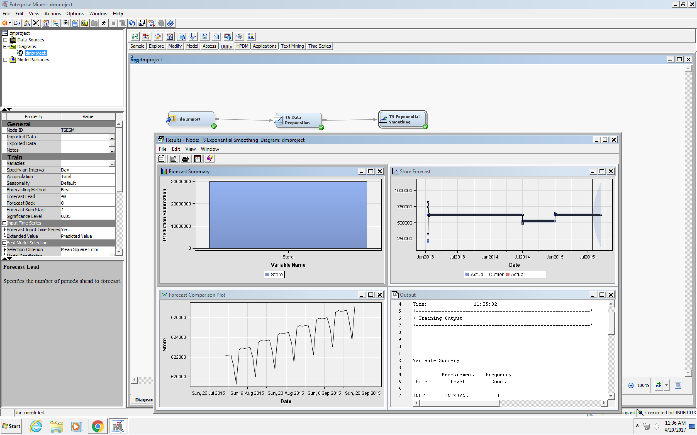

```{r setup, include=FALSE}
knitr::opts_chunk$set(echo = FALSE, warning = F, message = F)
knitr::opts_chunk$set(cache = TRUE)
```

``` {r}
{
  library(lubridate) # Handling dates
  library(stringr) # Handling strings
  library(readr) # Reading csv files
  library(tidyr) # Data manipulation
  library(dplyr) # Data manipulation
  library(ggplot2) # Plots
  library(forcats) # Factors
  library(knitr) # Clean tables
  library(stats)
  library(ggfortify)
  library(scales)
  library(forecast)
  library(tibble)
  library(purrr)
  library(cluster)
}

read.prep.data <- function() {
  rossman.train <- read_csv(file = './data/train.csv',
                            col_types = 'icDiiiici')
  rossman.test <- read_csv(file = './data/test.csv',
                           col_types = 'iicDcccc')
  rossman.store <- read_csv(file = './data/store.csv',
                            col_types = 'icciiiciic')
  
  # Reformat and clean up data
  
  rossman.store <-
    rossman.store %>%
    mutate(Assortment = fct_recode(Assortment,
                                   "Basic" = "a",
                                   "Extra" = "b",
                                   "Extended" = "c"))
  
  rossman.train <-
    rossman.train %>%
    mutate(DayOfWeek = fct_recode(DayOfWeek,
                                  "Monday" = "1" ,
                                  "Tuesday" = "2" ,
                                  "Wednesday" = "3" ,
                                  "Thursday" = "4" ,
                                  "Friday" = "5" ,
                                  "Saturday" = "6" ,
                                  "Sunday" = "7" ),
           StateHoliday = fct_recode(StateHoliday,
                                     "None" = "0",
                                     "Public" = "a",
                                     "Easter" = "b",
                                     "Christmas" = "c"))
  return(list(rossman.train, rossman.test, rossman.store))
}


{
  rossman.data <- read.prep.data()
  rossman.train <- rossman.data[[1]]
  rossman.test <- rossman.data[[2]]
  rossman.store <- rossman.data[[3]]
  rm(rossman.data)
}

#Create a new variable CompetitionStart in date format combining
#CompetitionOpensSinceMonth and CompetitionOpensSinceYear
day <- 15
rossman.store$CompetitionStart <- str_c(rossman.store$CompetitionOpenSinceYear,"-",rossman.store$CompetitionOpenSinceMonth,"-",day)
rossman.store$CompetitionStart <- parse_date_time(rossman.store$CompetitionStart, "Y-m-d", tz = "America/New_York")

#Create a new variable PromoSinceDate in date format combining
#Promo2SinceYear and Promo2SinceWeek
rossman.store$PromoSinceDate <- as.Date(paste(rossman.store$Promo2SinceYear,rossman.store$Promo2SinceWeek, 1, sep="-"), "%Y-%U-%u")

#Remove unusable variables holding values of month and year
rossman.store[,c(5,6,8,9)] <- NULL

```

```{r, fig.height = 3, fig.width = 4}
# Merge store data into the sales data

merged.rossman.train <-
  rossman.train %>%
  left_join(rossman.store, by = 'Store')
```

\pagebreak

## Grouping the stores into bins

Instead of building 1105 different models, one for each store. We grouped the stores into 20 different groups. The grouping was based on the average daily store sales. We can see clearly, that the bins are closer together for smaller sales and the bin size is wider as we ove along the x-axis increasing the sales.

```{r}
## Cluster data
bins = 20
{
  store.clusters <- 
    rossman.train %>%
    group_by(Store) %>%
    summarize(Sales = mean(Sales),
              Customers = mean(Customers)) %>%
    left_join(rossman.store, by = "Store") %>%
    select(Sales, Customers, Store) %>% 
    mutate(bin = ntile(Sales, bins))
  
  store.clusters %>%
    group_by(bin) %>%
    summarize(ymax = max(Sales),
              ymin = min(Sales)) %>%
    ggplot() +
    geom_errorbar(mapping = aes(x = 30,
                                ymax = ymax,
                                ymin = ymin,
                                color = bin),
                  size = 3) +
    
    geom_jitter(data = store.clusters,
                mapping = aes(x = 300,
                              y = Sales,
                              color = bin),
                width = 250) +
    theme(axis.title.y=element_blank(),
        axis.text.y=element_blank(),
        axis.ticks.y=element_blank()) + 
    labs(title = "Binning the sales",
         x = "Sales") +
    coord_flip()
}
```

\pagebreak

## Forecast package (Exponential smoothing state space model)

Exponential smoothing was a method proposed in 1950s by Brown (1959), Holt (1957), and Winters (1960). It has been the motivation for some of the most successful forecasting methods.
The forecasts produced using the ETS methods are weighted averages of past observations, with the weights decreasing exponentially as the observations get older. 
This means that the recent observations are associated with higher weights and the older observations are associated with smaller weights. 
The ETS method is used to generate reliable forecastly quickly and for a wide range of time series.

Each model consists of a measurement equation that describes the observed data, and some transition equations that describe how the unobserved components or states (level, trend, seasonal) change over time. Hence, these are referred to as “state space models”.


```{r}
# Prepare data for forecast method
{
  forecast_data <-
    rossman.train %>%
    left_join(store.clusters, by = "Store") %>%
    group_by(Date, bin) %>%
    summarize(Sales = mean(Sales.x))
}

## Generic function for fitting model
forecast_fit <- function(d, func = ets) {
  Sales <- ts(d$Sales, frequency = 7)
  lambda <- BoxCox.lambda(Sales)
  tsclean(Sales, replace.missing = TRUE, lambda = lambda)
  # External regressors to be used in the ARIMA model
  # xreg <-
  #   d %>%
  #   head((nrow(d) - 42)) %>%
  #   mutate(Open = as.numeric(Open),
  #          Promo = as.numeric(Open)) %>%
  #   select(c(Open, Promo))
  fit <- func(Sales, lambda = lambda)
  return(fit)
}

forecast.store <- function(bin.id) {
    store <-
      forecast_data %>% 
      filter(bin == bin.id)
    fit_ets <- forecast_fit(store)
    
    forecast_ets <- forecast(object = fit_ets, h = 48, robust = T)
    pred.ets <- forecast_ets$mean
    return(pred.ets)
}

# Submissions
{
  a <- c(1:bins) %>%
  map(forecast.store) %>%
  unlist
    
  predictions <- as_tibble(cbind(predicted = a,
                                 Date = c(rep(c(1:48), bins)),
                                 bin = sort(c(rep(c(1:bins), 48)))))
  predictions <- predictions %>%
    mutate(predicted = ifelse(predicted < 300, 0, predicted))
  
  r <- rossman.test %>%
    left_join(store.clusters, by = "Store") %>%
    select(Store, Date, bin, Id, Sales) %>%
    mutate(Date = as.numeric(Date - min(Date) + 1)) %>%
    left_join(predictions, by = c("Date" = "Date", "bin" = "bin")) %>%
    select(Id, Date, Store, Sales, predicted)
}
{
  merged <- 
    rossman.test %>%
    left_join(store.clusters, by = "Store") %>%
    select(Store, Date, bin, Id, Sales) %>%
    mutate(DateNum = as.numeric(Date - min(Date) + 1)) %>%
    left_join(predictions, by = c("DateNum" = "Date", "bin" = "bin")) %>%
    select(Id, Date, Store, Sales, predicted)
  
    rossman.train %>%
      bind_rows(merged) %>%
      filter(Store == 1100) %>%
      select(Date, Sales, predicted) %>%
      mutate(Flag = is.na(predicted),
             Sales = ifelse(is.na(predicted), Sales, predicted)) %>%
      ggplot() +
      geom_line(mapping = aes(x = Date,
                            y = Sales,
                            color = Flag))
}
```

\pagebreak

## SAS - ETS

Exponential smoothing state space model is also available in SAS and we use can use it with the same parameters as in R to build this model.



Model | Training Error | Test Error
--|--|--
R - ETS | 22% | 25%
SAS - ETS Testing | 24% | 26%
Kaggle Winner |  | 11%

\pagebreak

## Final Results

Model | Training Error | Test Error
--|--|--
R - ETS | 22% | 25%
SAS - ETS Testing | 24% | 26%
XGBoost | 20% | 21%
Kaggle Winner | | 11%

##Sources

The following resources were refered while creating the proposal:  

__1. Kaggle__ - Rossmann Store Sales dataset:
https://www.kaggle.com/c/rossmann-store-sales  


__2. Rossman Store Sales - Filling Gaps in the Training Set__  
Norman Secord  
https://www.kaggle.com/nsecord/rossmann-store-sales/filling-gaps-in-the-training-set  

__3. Forecasting: Principles and Practice __  
Rob J Hyndman and George Athanasopoulos  
https://www.otexts.org/fpp2/  

__4. An Introduction to Statistical Learning__    
Gareth James, Daniela Witten, Trevor Hastie, Robert Tibshirani

__5. XGBoost Rossmann Parameter Tuning__
https://www.kaggle.com/khozzy/rossmann-store-sales/xgboost-parameter-tuning-template/run/90168

***

## Questions?
