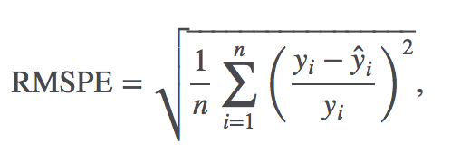

```{r setup, include=FALSE}
knitr::opts_chunk$set(echo = FALSE, warning = F, message = F)
knitr::opts_chunk$set(cache = TRUE)
```

``` {r}
{
  library(lubridate) # Handling dates
  library(stringr) # Handling strings
  library(readr) # Reading csv files
  library(tidyr) # Data manipulation
  library(dplyr) # Data manipulation
  library(ggplot2) # Plots
  library(forcats) # Factors
  library(knitr) # Clean tables
  library(stats)
  library(ggfortify)
  library(scales)
  library(forecast)
  library(tibble)
  library(purrr)
  library(cluster)
}

read.prep.data <- function() {
  rossman.train <- read_csv(file = './data/train.csv',
                            col_types = 'icDiiiici')
  rossman.test <- read_csv(file = './data/test.csv',
                           col_types = 'iicDcccc')
  rossman.store <- read_csv(file = './data/store.csv',
                            col_types = 'icciiiciic')
  
  # Reformat and clean up data
  
  rossman.store <-
    rossman.store %>%
    mutate(Assortment = fct_recode(Assortment,
                                   "Basic" = "a",
                                   "Extra" = "b",
                                   "Extended" = "c"))
  
  rossman.train <-
    rossman.train %>%
    mutate(DayOfWeek = fct_recode(DayOfWeek,
                                  "Monday" = "1" ,
                                  "Tuesday" = "2" ,
                                  "Wednesday" = "3" ,
                                  "Thursday" = "4" ,
                                  "Friday" = "5" ,
                                  "Saturday" = "6" ,
                                  "Sunday" = "7" ),
           StateHoliday = fct_recode(StateHoliday,
                                     "None" = "0",
                                     "Public" = "a",
                                     "Easter" = "b",
                                     "Christmas" = "c"))
  return(list(rossman.train, rossman.test, rossman.store))
}


{
  rossman.data <- read.prep.data()
  rossman.train <- rossman.data[[1]]
  rossman.test <- rossman.data[[2]]
  rossman.store <- rossman.data[[3]]
  rm(rossman.data)
}

#Create a new variable CompetitionStart in date format combining
#CompetitionOpensSinceMonth and CompetitionOpensSinceYear
day <- 15
rossman.store$CompetitionStart <- str_c(rossman.store$CompetitionOpenSinceYear,"-",rossman.store$CompetitionOpenSinceMonth,"-",day)
rossman.store$CompetitionStart <- parse_date_time(rossman.store$CompetitionStart, "Y-m-d", tz = "America/New_York")

#Create a new variable PromoSinceDate in date format combining
#Promo2SinceYear and Promo2SinceWeek
rossman.store$PromoSinceDate <- as.Date(paste(rossman.store$Promo2SinceYear,rossman.store$Promo2SinceWeek, 1, sep="-"), "%Y-%U-%u")

#Remove unusable variables holding values of month and year
rossman.store[,c(5,6,8,9)] <- NULL

```

## The Problem And Background

Rossmann is a Germany's second largest drug store chain and operates over 3,000 drug stores in 7 European countries.

Rossman challenged data scientists on [Kaggle](https://www.kaggle.com/c/rossmann-store-sales) to predict 6 weeks of daily sales for 1,115 stores located across Germany.

The following factors can affect the store sales:

* promotions,
* competition,
* school and state holidays,
* seasonality, and
* locality.

## Objective

To build a model to Forecast sales using store, promotion, and competitor data.

## Approach

* Data preparation
    - Merge data set
* Exploratory Data Analysis

***

* Modelling
    - Log Forecast Model
    - Forecast package - Exponential smoothing state space model
    - XGBoost
* Evaluating and Comparing the models

## About the Data

[Source: Kaggle](https://www.kaggle.com/c/rossmann-store-sales/data)

Historical sales data for 1,115 Rossmann stores is provided.
The task is to forecast the "Sales" column for the test set.

### Files

* __train.csv__ - historical data including Sales
* __test.csv__  - historical data excluding Sales
* __store.csv__ - supplemental information about the stores

***

### Data dictionary

__Train__

* __Id__ - an Id that represents a (Store, Date) duple within the test set
* __Store__ - a unique Id for each store
* __Sales__ - the turnover for any given day (this is what you are predicting)
* __Customers__ - the number of customers on a given day
* __Open__ - an indicator for whether the store was open: 0 = closed, 1 = open

***

* __StateHoliday__ - indicates a state holiday. Normally all stores, with few exceptions, are closed on state holidays. Note that all schools are closed on public holidays and weekends. a = public holiday, b = Easter holiday, c = Christmas, 0 = None
* __SchoolHoliday__ - indicates if the (Store, Date) was affected by the closure of public schools

***

__Store Data__

* __StoreType__ - differentiates between 4 different store models: a, b, c, d
* __Assortment__ - describes an assortment level: a = basic, b = extra, c = extended
* __CompetitionDistance__ - distance in meters to the nearest competitor store
* __CompetitionOpenSince [Month/Year]__ - gives the approximate year and month of the time the nearest competitor was opened

***

* __Promo__ - indicates whether a store is running a promo on that day
* __Promo2__ - Promo2 is a continuing and consecutive promotion for some stores: 0 = store is not participating, 1 = store is participating
* __Promo2Since [Year/Week]__ - describes the year and calendar week when the store started participating in Promo2
* __PromoInterval__ - describes the consecutive intervals Promo2 is started, naming the months the promotion is started anew. E.g. "Feb,May,Aug,Nov" means each round starts in February, May, August, November of any given year for that store

***

### Data reformatting

* Conversion of formats
* Recoding levels for factor variables

***

### Combining Variables
  
* Merged CompetitionOpenSinceMonth and CompetitionOpenSinceYear variables.
* Similarly, merged the Promo2SinceYear and Promo2SinceWeek variables

### Missing value and outliers

> "An explicit missing value is the presence of an absence; an implicit missing value is the absence of a presence" - Hadley Wickam

***

Two types of missing values:

__Explicit missing value__

Field | Missing Count
---|---
CompetitionDistance | `r sum(is.na(rossman.store$CompetitionDistance))`
CompetitionStart | `r sum(is.na(rossman.store$CompetitionStart))`
PromoSinceDate | `r sum(is.na(rossman.store$PromoSinceDate))`
PromoInterval | `r sum(is.na(rossman.store$PromoInterval))`

***

__Implicit missing value__

The number of stores that have recorded sales data falls significantly during a 6 month period. This information was provided in the data description as:

> Note that some stores in the dataset were temporarily closed for refurbishment.

These are implicit missing values in the sense that there are no NAs present in the data set. Instead the expected rows are missing all together.

```{r, fig.height = 3, fig.width = 4}
# Merge store data into the sales data

merged.rossman.train <-
  rossman.train %>%
  left_join(rossman.store, by = 'Store')
```

***

## Exploratory Data Analysis

    
```{r}
## Get data for a store, store 1
{
  store.1 <-
  rossman.train %>% 
  filter(Store == 1) 
}

## Exploration
  store.1 %>%
    select(Date, Sales, DayOfWeek) %>%
    ggplot() +
    geom_line(mapping = aes(x = Date,
                            y = Sales),
              color = "#3498db") +
    geom_hline(mapping = aes(yintercept = mean(Sales)),
               color = '#e74c3c',
               show.legend = T) + 
    ggtitle(label = "Store 1: Daily Sales")
```

***

```{r}
  store.1 %>%
    select(Date, Sales, DayOfWeek) %>%
    filter(Date < "2013-02-01") %>%
    ggplot() +
    geom_line(mapping = aes(x = Date,
                            y = Sales),
              color = "#3498db") +
    geom_hline(mapping = aes(yintercept = mean(Sales)),
               color = '#e74c3c',
               show.legend = T) + 
    ggtitle(label = "Store 1: Daily Sales in January, 2013")
```

***

```{r}
  store.1 %>%
    group_by(DayOfWeek) %>%
    summarize(Avg_Sales = mean(Sales)) %>%
    ggplot() +
    geom_bar(mapping = aes(x = DayOfWeek,
                           y = Avg_Sales),
             fill = "#3498db",
             stat = "identity") +
    ggtitle(label = "Store 1: Daily Sales in January, 2013")
```

***

```{r}
## Cluster data
bins = 20
{
  store.clusters <- 
    rossman.train %>%
    group_by(Store) %>%
    summarize(Sales = mean(Sales),
              Customers = mean(Customers)) %>%
    left_join(rossman.store, by = "Store") %>%
    select(Sales, Customers, Store) %>% 
    mutate(bin = ntile(Sales, bins))
  
  store.clusters %>%
    group_by(bin) %>%
    summarize(ymax = max(Sales),
              ymin = min(Sales)) %>%
    ggplot() +
    geom_errorbar(mapping = aes(x = 30,
                                ymax = ymax,
                                ymin = ymin,
                                color = bin),
                  size = 3) +
    
    geom_jitter(data = store.clusters,
                mapping = aes(x = 300,
                              y = Sales,
                              color = bin),
                width = 250) +
    theme(axis.title.y=element_blank(),
        axis.text.y=element_blank(),
        axis.ticks.y=element_blank()) + 
    labs(title = "Binning the sales",
         x = "Sales") +
    coord_flip()
}
```


## Models

The aim of modeling on the Rossmann Stores data is to predict the daily sales of stores for upto 6 weeks.
The primary models we would use for this purpose are:  

* __Log Forecast Model__  
     
* __Forecast package - (ETS)__ 

* __XGBoost__
    
    
## Evaluation Criteria

The Kaggle competition used Root Mean Square Percentage Error (RMSPE) as the evaluation metric and we will be using the same metric for evaluating the predictive performance of our model.
The RMSPE is calculated as



where 

$y_{i}$ denotes the sales of a single store on a single day
$yhat_{i}$ denotes the corresponding prediction.

## Log Forecast Model

```{r}
logSales <- 
  read_csv(file = './data/submission-log20.csv') %>%
  left_join(rossman.test, by = "Id") %>%
  mutate(Flag = 0) %>%
  select(Date, Sales, Store, Flag)

m <- 
  rossman.train %>%
  mutate(Flag = 1) %>%
  bind_rows(logSales)

m %>%
      filter(Store == 1100) %>%
      select(Date, Sales, Flag) %>%
      ggplot() +
      geom_line(mapping = aes(x = Date,
                            y = ifelse(Sales > 0, log(Sales), 0),
                            color = as.factor(Flag))) +
    labs(x = "Date",
         y = "Log Sales",
         title = "Log Forecast Model") +
    theme(legend.position = "none")
```

***

Model | Training Error | Test Error
--|--|--
R - Log Forecast | 27% | 29%
Kaggle Winner | | 11%

## Forecast package (Exponential smoothing state space model)


```{r}
# Prepare data for forecast method
{
  forecast_data <-
    rossman.train %>%
    left_join(store.clusters, by = "Store") %>%
    group_by(Date, bin) %>%
    summarize(Sales = mean(Sales.x))
}

## Generic function for fitting model
forecast_fit <- function(d, func = ets) {
  Sales <- ts(d$Sales, frequency = 7)
  lambda <- BoxCox.lambda(Sales)
  tsclean(Sales, replace.missing = TRUE, lambda = lambda)
  # External regressors to be used in the ARIMA model
  # xreg <-
  #   d %>%
  #   head((nrow(d) - 42)) %>%
  #   mutate(Open = as.numeric(Open),
  #          Promo = as.numeric(Open)) %>%
  #   select(c(Open, Promo))
  fit <- func(Sales, lambda = lambda)
  return(fit)
}

forecast.store <- function(bin.id) {
    store <-
      forecast_data %>% 
      filter(bin == bin.id)
    fit_ets <- forecast_fit(store)
    
    forecast_ets <- forecast(object = fit_ets, h = 48, robust = T)
    pred.ets <- forecast_ets$mean
    return(pred.ets)
}

# Submissions
{
  a <- c(1:bins) %>%
  map(forecast.store) %>%
  unlist
    
  predictions <- as_tibble(cbind(predicted = a,
                                 Date = c(rep(c(1:48), bins)),
                                 bin = sort(c(rep(c(1:bins), 48)))))
  predictions <- predictions %>%
    mutate(predicted = ifelse(predicted < 300, 0, predicted))
  
  r <- rossman.test %>%
    left_join(store.clusters, by = "Store") %>%
    select(Store, Date, bin, Id, Sales) %>%
    mutate(Date = as.numeric(Date - min(Date) + 1)) %>%
    left_join(predictions, by = c("Date" = "Date", "bin" = "bin")) %>%
    select(Id, Date, Store, Sales, predicted)
}
{
  merged <- 
    rossman.test %>%
    left_join(store.clusters, by = "Store") %>%
    select(Store, Date, bin, Id, Sales) %>%
    mutate(DateNum = as.numeric(Date - min(Date) + 1)) %>%
    left_join(predictions, by = c("DateNum" = "Date", "bin" = "bin")) %>%
    select(Id, Date, Store, Sales, predicted)
  
    rossman.train %>%
      bind_rows(merged) %>%
      filter(Store == 1100) %>%
      select(Date, Sales, predicted) %>%
      mutate(Flag = is.na(predicted),
             Sales = ifelse(is.na(predicted), Sales, predicted)) %>%
      ggplot() +
      geom_line(mapping = aes(x = Date,
                            y = Sales,
                            color = Flag))
}
```

## SAS - ETS


***

Model | Training Error | Test Error
--|--|--
R - ETS | 22% | 25%
SAS - ETS Testing | 24% | 26%
Kaggle Winner |  | 11%

***

## XGBoost
Designed to improve the performance of boosted trees. 
High predictive power but slow with implementation.
All variables must be in numeric format.

Performed 3-fold CV using 30 trees.

***

##Train RMPSE

***

##Test RMPSE


***

## Final Results

Model | Training Error | Test Error
--|--|--
R - Log Forecast | 27% | 29%
R - ETS | 22% | 25%
SAS - ETS Testing | 24% | 26%
XGBoost | 20% | 21%
Kaggle Winner | | 11%


## Timeline

Phase | Date
---|---|---
Data cleaning and preparation | Apr 04, 2017 
EDA | Apr 09, 2017 
Modelling and evaluation | Apr 14, 2017 
Comparing models | Apr 17, 2017 
Collation of results into report and presentation | Apr 19, 2017 

##Sources

The following resources were refered while creating the proposal:  

__1. Kaggle__ - Rossmann Store Sales dataset:
https://www.kaggle.com/c/rossmann-store-sales  


__2. Rossman Store Sales - Filling Gaps in the Training Set__  
Norman Secord  
https://www.kaggle.com/nsecord/rossmann-store-sales/filling-gaps-in-the-training-set  

__3. Forecasting: Principles and Practice __  
Rob J Hyndman and George Athanasopoulos  
https://www.otexts.org/fpp2/  

__4. An Introduction to Statistical Learning__    
Gareth James, Daniela Witten, Trevor Hastie, Robert Tibshirani

__5. XGBoost Rossmann Parameter Tuning__
https://www.kaggle.com/khozzy/rossmann-store-sales/xgboost-parameter-tuning-template/run/90168

***

## Questions?
